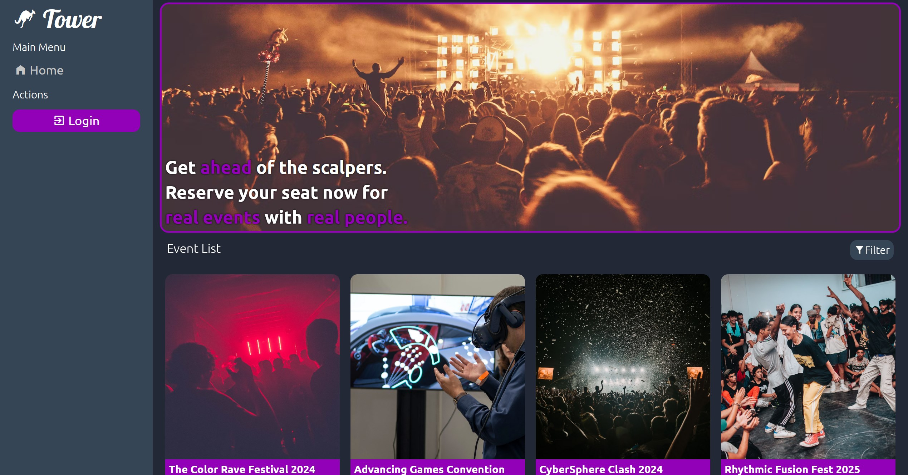

 

# Tower

[Tower Live Demo](https://tower.arringtonm.com/)

## Summary

Tower is a full-stack web application where users can post, comment on and attend events. When a user attends, it adds them to the attendee list and allows also adds it to their own personal list of events they're attending, which is viewable on the user's account page. 

## Technologies Used

- VueJS for the Frontend Javascript Framework
- Node and Express for Backend Framework
- RESTful API conventions in order to have consistent API naming conventions
- MongoDB for Database
- Auth0 for user authentication

## What I learned
With this application I learned how to go through the whole full-stack process with the MEVN tech stack, implementing the MVC design pattern on my backend and a similar like structure to my frontend. This was also one of my big VueJS projects, and I was able to get comfortable with stylizing and using the Vue-Router library. 
